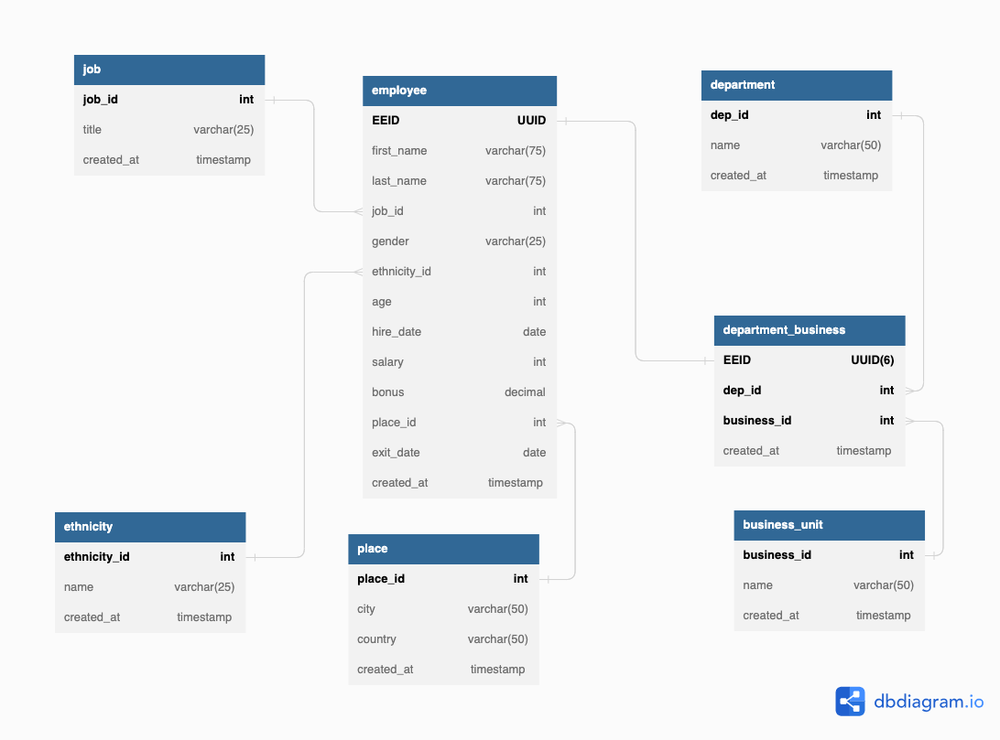

## Employees
*By: Jeet Soni*

*Date: 06/24/2023*
_______
### **Description**
Man, what can I say, I am really enjoying normalizing the tables and as it comes naturally to mind what to do next and how to break it down, it becomes more fun because I know what I am doing. This time it's a employee database. I broke it down from a excel file, normalized and built the tables to keep records of employees. 

### **Data**

| EEID | full name | job title | department | business unit | gender | ethnicity | age   | hire date  | salary | bonus | country | city | exit date |
|---|---|---|---|---|---|---|---|---|---|---|---|---|---|
| 1 | Emily Davis | Sr. Manger | IT  |Research & Development | Female |Black   | 55  | 4/8/2016 | 141,604  | 15%  | United States | Seattle | 10/16/2021 |
| 2 | Theodore Dinh  | Technical Architect  | IT | Manufacturing  | Male  |  Asian | 59 | 11/29/1997 | 99,975  | 0% | China | Chongqing | 
| 3 | Luna Sanders  | Technical Architect  | Finance |  speciality product | Female  |  Caucasian | 50 | 10/26/2014  | 163,099  | 20%  | United States | Chicago |

### **ER Diagram**

### **Conclusion**

I am open for suggestions and what more can I do to make it better but this was fun. I am getting pretty good at normalizing :)

Jeet Soni

